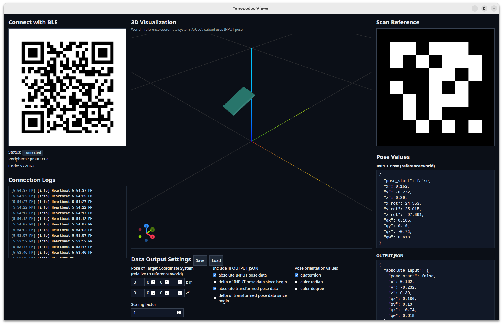

<p align="center">
  
</p>

**Televoodoo Viewer** is a cross‑platform desktop application built around the Python package [televoodoo](https://github.com/Mana-Robotics/televoodoo) for fast, visual testing and configuration. It hosts a BLE peripheral that the Televoodoo mobile app (iOS/Android) connects to, streams 6‑DoF pose and scene data, and renders them in an interactive 3D view. The viewer lets you inspect both input and transformed poses and export configuration files compatible with [televoodoo](https://github.com/Mana-Robotics/televoodoo) for use in other projects. The app is built with Tauri, Svelte, and Threlte, with a Python sidecar providing core [televoodoo](https://github.com/Mana-Robotics/televoodoo) functionality.

<p align="center">
  
</p>

## Requirements
- Node 18+
- Rust toolchain (for Tauri)
- Python 3.10+

### Install Node and Rust (macOS & Ubuntu)

- macOS
  - Install Node.js: Use Homebrew or the official installer.
    - Homebrew:
      ```
      brew install node
      ```
    - Official Node installer: see Node.js downloads (https://nodejs.org/en/download)
  - Install Rust toolchain: Use rustup (recommended). See Rust installation guide (https://www.rust-lang.org/learn/get-started)
      ```
      curl --proto '=https' --tlsv1.2 -sSf https://sh.rustup.rs | sh
      ```
- Ubuntu
  - Install build tools and system dependencies:
    ```
    sudo apt-get update
    sudo apt-get install -y build-essential python3-dev libdbus-1-dev libglib2.0-dev libcairo2-dev libwebkit2gtk-4.1-dev libgtk-3-dev libpango1.0-dev python3-venv
    ```
  - Install Node.js: node, nvm and npm.
    - Download from the official site: see Node.js downloads (https://nodejs.org/en/download)
    - Install according to instructions
  - Rust toolchain: Use rustup (recommended).
    ```
    curl --proto '=https' --tlsv1.2 -sSf https://sh.rustup.rs | sh
    ```

## Install
1. Clone the repository
```
git clone https://github.com/Mana-Robotics/televoodoo-viewer.git
cd televoodoo-viewer
```
2. Sync submodules (fetch Python core `televoodoo`)
```
git submodule sync --recursive
git submodule update --init --recursive
```
3. Install dependencies
```
npm install
```


## Run (Development Mode)
```
npm run tauri:dev
```

## Build
```
npm run tauri:build
```

## Notes
- QR content format: see SPECS/QR_CODE_READING_GUIDE.md
- BLE API: see SPECS/BLUETOOTH_API_DOCUMENTATION.md
- Input pose data: see SPECS/INPUT_POSE_DATA_FORMAT.md
- Coordinate systems: World coordinate system equals the reference coordinate system (defined by the scanned ArUco-Marker). The 3D cuboid uses INPUT pose values (reference/world) directly. OUTPUT transforms only affect JSON output.

## Maintainer

Developed with ❤️ for 🤖 by [Mana Robotics](https://www.mana-robotics.com).
## License

MIT License — see [LICENSE](LICENSE) for details.
